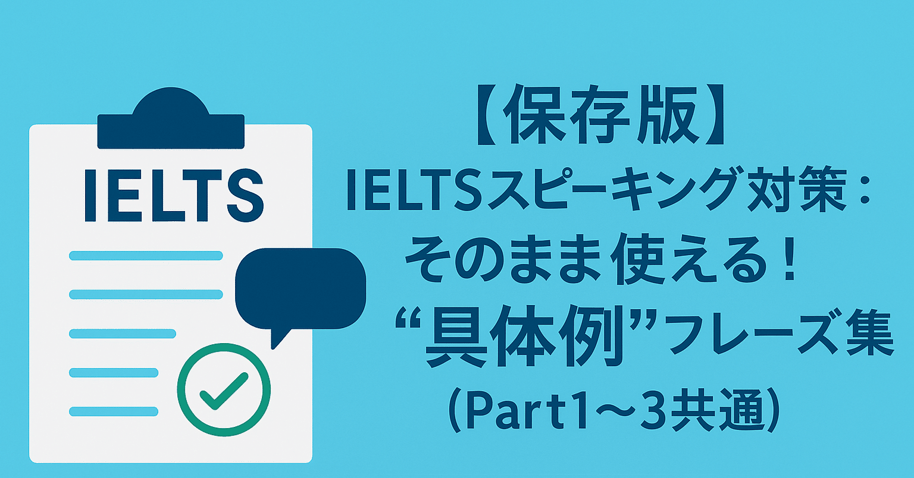

# 画像表示の問題デバッグ

## 問題の記事

記事ID: `n5e563cd04240`  
タイトル: 【保存版】IELTSスピーキング対策：そのまま使える！加点につながる"具体例"フレーズ集（Part1〜3共通）

## 原因の可能性

### 1. 画像パスの問題

元のHTMLファイル:
```html

```

インポートスクリプトによる変換:
```html

```

MDXのFrontmatterで設定されるヒーロー画像:
```yaml
hero: "/assets/n5e563cd04240_2f03330b858d280a515de0e1e1ab10f5.png"
```

### 2. 画像ファイルのコピー確認

インポートスクリプトは以下を実行:
```typescript
// assets/ → public/assets/ にコピー
await fs.copy(SOURCE_ASSETS_DIR, PUBLIC_ASSETS_DIR, { overwrite: true });
```

**確認事項**:
- ✅ `assets/n5e563cd04240_*.png` が存在するか
- ✅ `public/assets/n5e563cd04240_*.png` にコピーされているか
- ✅ Netlify でビルド時に画像がコピーされているか

### 3. ファイルサイズの問題

大きな画像ファイル（2MB以上）は読み込みに時間がかかる可能性があります。

**解決策**:
- 画像圧縮ツールを使用（TinyPNG、Squooshなど）
- Next.js の Image Optimization（ただし静的エクスポートでは制限あり）

### 4. Content-Type の問題

静的ファイルが正しく配信されているか確認が必要です。

## デバッグ手順

### ローカル環境で確認

```bash
# 記事をインポート
pnpm run import:note

# public/assets に画像がコピーされたか確認
ls -la public/assets/n5e563cd04240_*

# 開発サーバー起動
pnpm run dev

# ブラウザで確認
# - http://localhost:3000/posts/n5e563cd04240
# - DevToolsで画像のネットワークリクエストを確認
```

### Netlify デプロイで確認

ビルドログで以下を確認:
```
✅ 記事をインポート中...
✅ [1/41] 【保存版】IELTSスピーキング対策...
✅ assetsディレクトリをコピーしました
```

### ブラウザで確認

デプロイ後、以下のURLを直接開いて確認:
```
https://ieltsconsult.netlify.app/assets/n5e563cd04240_2f03330b858d280a515de0e1e1ab10f5.png
```

画像が表示されない場合:
- 404エラー → 画像がコピーされていない
- 403エラー → パーミッションの問題
- タイムアウト → ファイルサイズが大きすぎる

## 解決策

### インポートスクリプトにログ追加

```typescript
console.log(`✅ Hero image: ${hero}`);
console.log(`📁 Copying ${fs.readdirSync(SOURCE_ASSETS_DIR).length} files from assets/`);
```

### 画像の最適化（推奨）

大きな画像（1MB以上）は事前に圧縮:
```bash
# ImageMagick を使用（例）
convert input.png -resize 1200x -quality 85 output.png
```

または、オンラインツール:
- [TinyPNG](https://tinypng.com/)
- [Squoosh](https://squoosh.app/)

### Fallback 画像の設定

画像が読み込めない場合の代替として、プレースホルダーを表示:

```tsx
 {
    e.currentTarget.src = '/placeholder.png';
  }}
/>
```

---

## Next Steps

1. ローカルで `pnpm run import:note` を実行
2. `public/assets/` に画像があることを確認
3. `content/posts/n5e563cd04240.mdx` の `hero` フィールドを確認
4. 開発サーバーで画像が表示されるか確認
5. 問題が続く場合、画像ファイルサイズを圧縮

